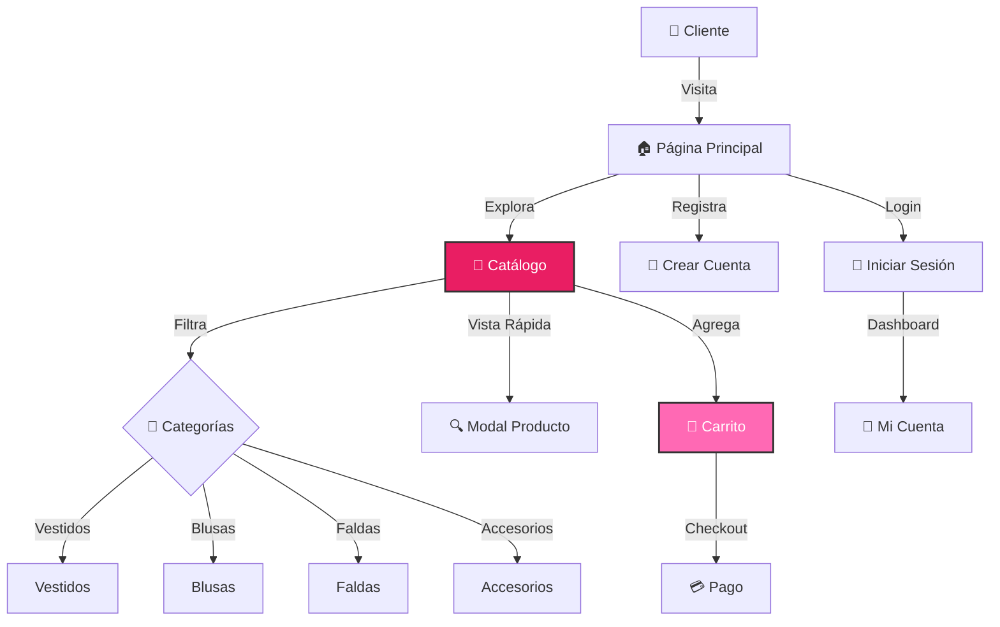
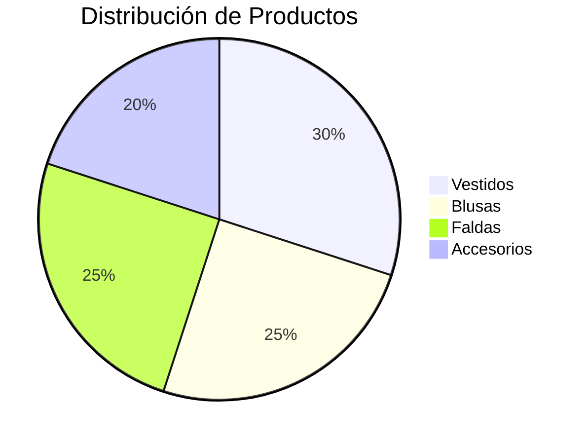

<table>
  <tr>
    <td width="150">
      <h1 style="font-size: 80px; margin: 0;">💖</h1>
    </td>
    <td>
      <h1>Pink Fashion Store</h1>
      <em>"Descubre tu estilo rosa"</em>
    </td>
  </tr>
</table>


## 💡 Sobre Pink Fashion Store

**Pink Fashion Store** es una tienda de moda femenina elegante y moderna. Con un diseño en tonos rosas, ofrece una experiencia de compra premium con carrito de compras, filtros de productos y sistema completo de usuarios.

### ✨ Características Principales

* **Catálogo con Filtros** - Vestidos, blusas, faldas, accesorios
* **Carrito de Compras** - Sistema completo de e-commerce
* **Vista Rápida** - Modal para ver productos sin salir
* **Newsletter** - Suscripción a ofertas exclusivas
* **Diseño Premium** - UI/UX elegante y femenino

### 🔄 Experiencia de Compra



---

## ✨ Características Destacadas

| ⚡ Funcionalidad | 📌 Detalle |
|-----------------|-----------|
| **Carrito Funcional** | Agrega, elimina y actualiza productos |
| **Filtros Dinámicos** | Por categoría: vestidos, blusas, faldas |
| **Vista Rápida** | Modal con detalles del producto |
| **Toast Notifications** | Feedback visual en acciones |
| **Sistema de Estrellas** | Rating visual de productos |
| **Responsive Design** | Menú hamburguesa en móviles |

---

## 🎨 Badges & Estado


---

## ⚙️ Instalación y Configuración

### 1️⃣ Clonar el Repositorio

```bash
git clone https://github.com/JoseEduardoGR/Pink-Fashion-Store.git
cd Pink-Fashion-Store
```

### 2️⃣ Configurar Base de Datos

```sql
CREATE DATABASE pink_fashion;
USE pink_fashion;
SOURCE sql/database.sql;
```

### 3️⃣ Configurar Conexión

Edita `config/database.php`:

```php
private $host = "localhost";
private $db_name = "pink_fashion";
private $username = "tu_usuario";
private $password = "tu_password";
```

### 4️⃣ Iniciar Servidor

```bash
php -S localhost:8000
```

Abre `http://localhost:8000` en tu navegador.

---

## 📂 Estructura del Proyecto

```
PINK-FASHION/
├── config/
│   └── database.php         # Conexión a BD
├── css/
│   └── style.css            # Estilos principales
├── includes/
│   ├── auth.php             # Autenticación
│   └── cart.php             # Lógica del carrito
├── js/
│   └── script.js            # Scripts del frontend
├── sql/                     # Esquemas de BD
├── cart.php                 # Página del carrito
├── cart_actions.php         # Acciones del carrito
├── dashboard.php            # Panel de usuario
├── index.php                # Página principal
├── login.php                # Inicio de sesión
├── logout.php               # Cerrar sesión
├── register.php             # Registro
├── products.php             # Catálogo
├── LICENSE                  # Licencia MIT
└── README.md                # Este archivo
```

---

## 👗 Categorías de Productos

| Categoría | Descripción | Stock |
|-----------|-------------|-------|
| **Vestidos** | Elegantes y casuales | Alta calidad |
| **Blusas** | Variedad de estilos | Todas las tallas |
| **Faldas** | Largas y cortas | Diseños únicos |
| **Accesorios** | Bolsos, joyería | Complementos |

---

## 🎀 Características Especiales



---

## 🛠️ Tecnologías Utilizadas

| Tecnología | Uso |
|------------|-----|
| **PHP 8+** | Backend y lógica |
| **MySQL** | Base de datos |
| **PDO** | Conexión segura |
| **CSS3** | Diseño rosa elegante |
| **JavaScript** | Carrito y modales |
| **Font Awesome** | Iconografía |

---

## 🏆 Créditos

**JoseEduardoGR** – Desarrollo y diseño.

💻 Proyecto educativo de preparatoria.

---

## 📄 Licencia

Este proyecto está bajo la **Licencia MIT** - ver el archivo [LICENSE](LICENSE) para más detalles.

---

<div align="center">
  <p>💖 Hecho con ❤️ por <a href="https://github.com/JoseEduardoGR">JoseEduardoGR</a></p>
  <p>Moda elegante y femenina para todas</p>
</div>
